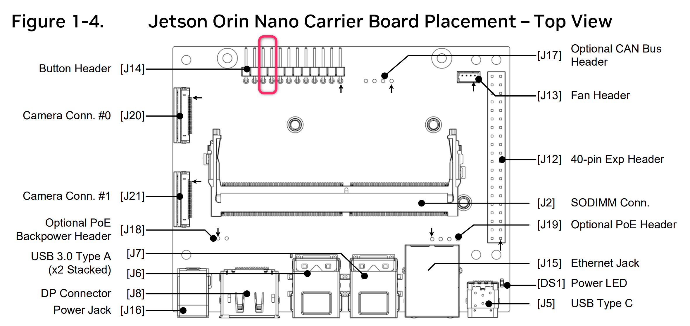
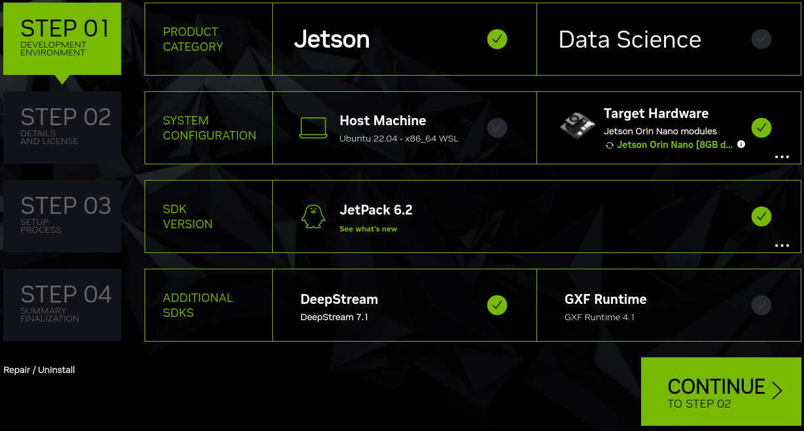

# Flashing a Jetson Orin Nano 8GB Developer Kit with WSL2 for Windows

Jetson expects the host OS to be Linux, but it's possible to flash from Windows using WSL2 and Ubuntu 22.04. By using the SDK Manager installation method, we can accomplish a number of things at once:
1. Upgrade firmware from the 5.0 release installed with 5.1.3
2. Install the latest Jetpack OS automatically
3. Install directly to NVMe, without having to flash to an SD Card.

## Prerequisites

### WSL2

1. Open Powershell.
2. Install Ubuntu 22.04 LTS: `wsl --install -d Ubuntu-22.04`
    - note: `Ubuntu` would install the default LTS. Jetson is currently only compatible with 22.04.
    - By default, you'll be dropped into the Ubuntu shell afterward.
4. Install a few utilities
   1. Utilities for WSL: `sudo apt install wslu -y`
   2. Prerequisites for SDK Manager: `sudo apt install iputils-ping iproute2 netcat-openbsd iptables dnsutils network-manager usbutils net-tools python3-yaml dosfstools libgetopt-complete-perl openssh-client binutils xxd cpio udev dmidecode -y`
   3. Tools for USB flashing: `sudo apt install linux-tools-virtual hwdata -y`

### Install SDK Manager in Ubuntu 22.04

1. In the Ubuntu shell, run the following:
    ```
    wget https://developer.download.nvidia.com/compute/cuda/repos/ubuntu2204/x86_64/cuda-keyring_1.1-1_all.deb
    sudo dpkg -i cuda-keyring_1.1-1_all.deb
    sudo apt-get update
    sudo apt-get -y install sdkmanager
    ```
2. Start the SDK Manager `sdkmanager`
3. On first launch, Login. If you are unable to login, you must be registered in the developer program at https://developer.nvidia.com/.
    - If you get an error like "User is not authorized on NVIDIA Developer server", you may have an NVIDIA account but need to complete your developer profile.

## Flash Jetson Firmware & OS

#### Start Ubuntu 22.04

1. Open Ubuntu terminal
2. Start SDK Manager: `sdkmanager`
3. Leave the terminal for now.

### Connect Jetson to PC in Recovery Mode
1. Connect your Jetson Orin Nano Developer Kit to your PC with a USB cable.
   - Note that the USB cable goes into the USB-C port of the carrier board of the developer kit.
2.While shorting pin 9 and pin 10 of J14 header located below the Jetson module using a jumper pin, insert the DC power supply plug into the DC jack of the carrier board to power it on.

3. in Windows Device manager, look for a device called _APX_. This is the Jetson in firmware flashing mode.


### Attach Jetson to Ubuntu

1. Open an administrator powershell
2. Look for the bus ID that the Jetson is linked in on by looking for `APX`. We will use ID `4-6`, replace with your `BUSID`.
3. Bind the interface to WSL2: `usbipd bind --busid 4-6 --force`
2. Start auto-attach of the Jetson to Ubuntu 22.04: `usbipd attach -b 4-6 -w Ubuntu-22.04 -a`
   - During the installation process, it'll detach and re-attach a number of times as a couple of devices, this will prevent the SDK Manager from timing out.
3. Confirm that it's correctly attached to the Ubuntu session by issuing `lsusb`, and looking for `ID 0955:7523 NVIDIA Corp. APX`

### Install/Upgrade Jetson
_This will simultaneously upgrade the firmware on the Jetson Orin Nano, and install the latest JetPack._

1. In SDK Manager, ensure the following are set:
   - STEP 01: Project Category: Jetson
   - STEP 02: Unckcek Host Machine, check Target Hardware. For Jetson Orin Nano Development board, ensure `Jetson Orin Nano [8GB developer kit]` is selected.
   - STEP 03: JetPack 6.2 (or whatever the latest is) should be selected by default
   - STEP 04: Leave any additional modules unchecked.
   - If everything was done correctly, it should look similar to this:
   
2. Press `CONTINUE TO STEP 02`
3. Uncheck everything except Jetson Linux We'll install additional components later. Make sure to check `I accept the terms and conditions of the license agreements`
4. Press `CONTINUE TO STEP 03`, enter your account password for sudo.
5. In the next popup, set `OEM Configuration` to `Runtime` and confirm the installation location (SD Card, NVMe, etc).

## Sources

- WSL2: https://learn.microsoft.com/en-us/windows/wsl/install
- SDK Manager w/WSL2: https://docs.nvidia.com/sdk-manager/wsl-systems/index.html
- USB/IP Project: https://learn.microsoft.com/en-us/windows/wsl/connect-usb
- Jetson Initial Setup SDK Manager: https://www.jetson-ai-lab.com/initial_setup_jon_sdkm.html